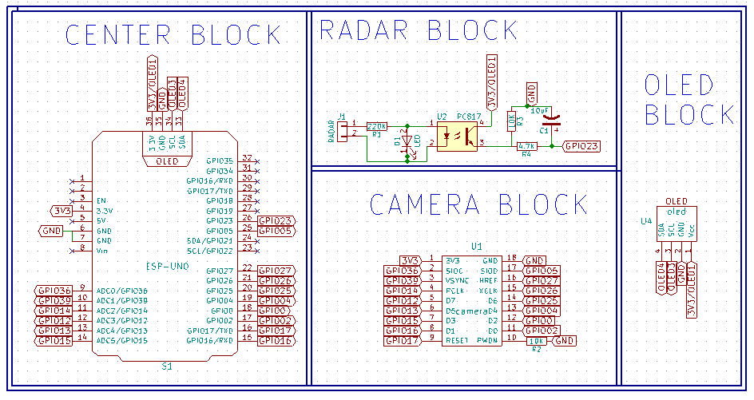
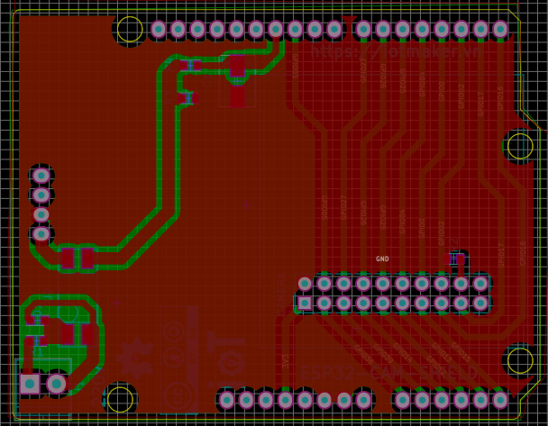
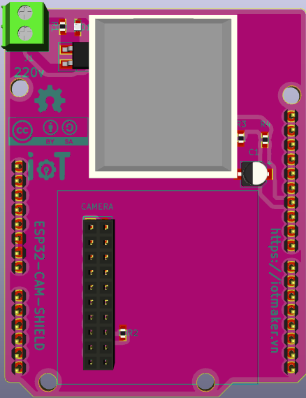

# esp32-cam-shield

## Features

esp32-cam-demo có thể:
- Power input 5.5V to 28VDC (1.2A/5V output) and 5V USB
- detected motions ( 0-8m), take a picture and send to server.
- stream video jpeg
- QR code Scan
#nguyên lý hoạt động
- khi radar phát hiện bất cứ chuyển động nào sẽ gửi tín hiệu đến esp32 ( được cách li quang thông qua opto) khi đó. esp32 sẽ ghi lại ảnh và gửi lên serve.
## Hardware

###Component

[ESP32 WIFI UNO](https://iotmaker.vn/esp32-wifi-uno.html)

[OLED SSD1306](https://iotmaker.vn/ssd1306-oled-096inch-128x64-i2c.html?combination=3_4)

[RADAR 220V AC](https://iotmaker.vn/cam-bien-vat-can-radar-220vac.html)

[MODULE CAMERA OV7725](https://iotmaker.vn/module-camera-ov7725.html)

### Schematics

### PCB Layout

### 3D

[]

### Gerber

[Download](./assets/esp32-cam-shield.zip)

### BOM 

| Designator | Package | Quantity | Designation  |
|-----------------------------------|--------------------------------|----------|--------------|
| U1	                            | PIN HEADER Straight 2x10       | 1        | CAMERA       |
| U2                                | TC817			     | 1        | OPTO PC817   |
| U4                                | PIN HEADER Straight 1x4        | 1        | OLED SSD1306 | 
| D2                                | LED_0603                       | 1        | LED_Blue     |
| C1                                | CP_Elec_4x5.3                  | 1        | 10uF/15      |
| R1				    | R_0603                         | 1        | 220k         |
| R2,R3			            | R_0603                         | 1        | 10k          |
| R4                                | R_0603                         | 1        | 4,7K         |
| J1                                | TerminalBlockPT-3.5mm_2pol     | 1        | CONNECTOR 2  |

### Remark

This project was in development phase - we will remove this remark after release

# License

